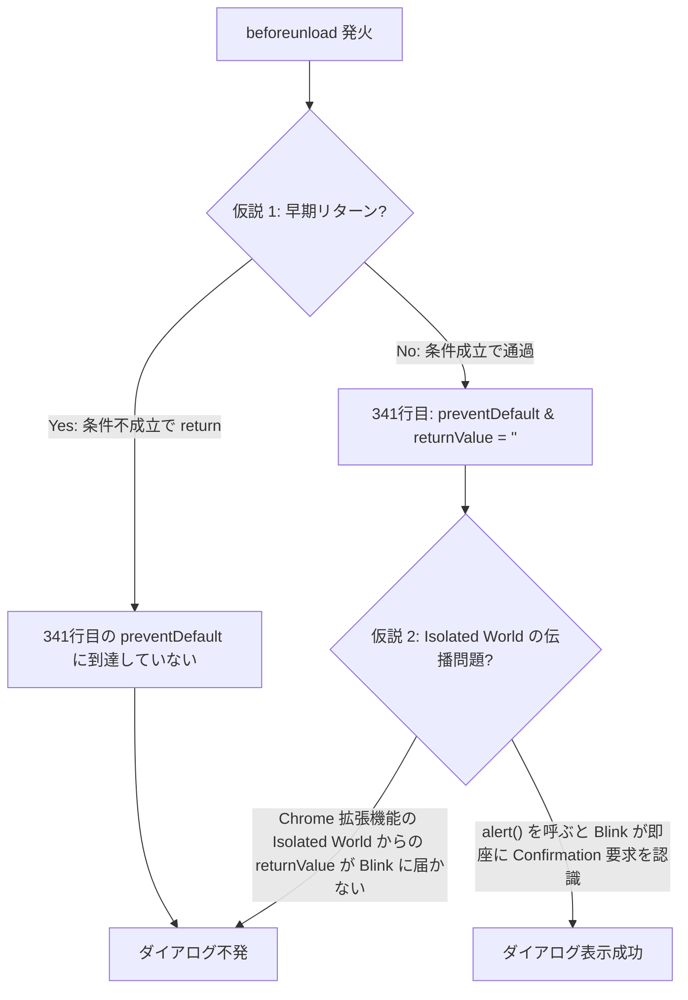

# `beforeunload` ダイアログ不発・`alert()` トリガー現象の解明と修正計画書

## 1. 現象の分析と技術的背景 (Goal Description)

### 1.1 確認された特異な挙動
- `content.js` の `beforeunload` ハンドラー冒頭に `alert('...')` を仕込むと、**アラート画面自体は表示されず、ブラウザ標準の離脱確認ダイアログ（「このサイトを離れますか？」）が期待通りに表示される**。
- `alert()` を外すと、確認ダイアログが表示されない。

### 1.2 なぜ `alert()` のダイアログは出ずに離脱確認が出るのか？（Chromium 仕様）
1. **`beforeunload` 内での `alert()` 抑止**:
   - Chromium（Chrome）のセキュリティ仕様上、悪意あるスクリプトによる離脱妨害を防ぐため、`beforeunload` イベント中の `alert()` / `confirm()` / `prompt()` モーダルダイアログの表示は**強制的にブロック（抑止）**されます。
2. **`alert()` 呼び出しが離脱確認シグナルとなる仕様**:
   - Chromium の Blink エンジンでは、`beforeunload` 中に `alert()` 等のモーダル API が呼ばれた場合、それを**「スクリプトがユーザーへの離脱確認を要求した」と解釈し、ブラウザ標準の離脱確認ダイアログを表示するトリガーとして扱う**内部動作が存在します。

---

## 2. なぜ `alert()` がないとダイアログが出ないのか？（2 つの仮説）



### 仮説 1: 条件判定で早期 `return` してしまい、341行目に到達していない
- `beforeunload` 内の判定（`!hasPendingLog || !isCurrentRoom` または `isPostMeetingScreen`）が真となり、`event.preventDefault()` を呼ぶ前にハンドラーを抜けている。
- 冒頭に `alert()` を置くと、その時点で Blink がダイアログ要求フラグを立てるため、その後の `return` に関係なくダイアログが出ていた。

### 仮説 2: `event.preventDefault()` / `event.returnValue` の伝播・記述仕様
- Chrome 拡張機能のコンテンツスクリプト（Isolated World）において、`event.returnValue = ''` のみでは Blink への伝播が不安定な場合がある（`return ''` や非空文字列、あるいは `window.onbeforeunload` の差異）。

---

## 3. 切り分けと調査手順 (Investigation Plan)

### ステップ 1: `alert` 配置位置による切り分け実験
1. **実験 A（末尾配置）**: `alert('test')` を **341行目（`event.preventDefault()` の直前）** に配置する。
   - **結果 A-1: ダイアログが出る場合** ➔ ガード条件は正常に通過している（仮説 2: トリガー方法の問題）。
   - **結果 A-2: ダイアログが出ない場合** ➔ 284〜338行目のいずれかで早期 `return` している（仮説 1: 条件判定の問題）。

2. **実験 B（Console ログ確認）**:
   - DevTools の Console 設定で **`Preserve log`（ログを保持）** を有効にし、リロード直前の `[GMCTC] beforeunload state` の出力を確認。
   - `hasPendingLog`, `pendingTextLength`, `isCurrentRoom`, `isInActiveCall`, `isPostMeetingScreen` の値を確認。

---

## 4. 解決策の設計 (Proposed Solution)

### 4.1 仮説 1（早期リターン）が原因の場合
- `beforeunload` 発火時のテキスト取得タイミングや `isInActiveCall` 判定の条件を調整し、通話中リロード時に確実に最終行へ到達するように修正。

### 4.2 仮説 2（Isolated World からのトリガー伝播）が原因の場合
- W3C / Chromium 仕様に準拠した確実なトリガー方式を適用：
  ```javascript
  event.preventDefault();
  event.returnValue = 'Save changes?';
  return 'Save changes?';
  ```
- 必要に応じて、Chromium が確実に離脱確認を認識するイディオム（または `window.onbeforeunload` との併用）を適用。

---

## 5. ユーザー確認事項 (User Review Required)

> [!TIP]
> まずは **「ステップ 1 の実験 A（341行目への `alert` 配置）」** または **「Console ログ（`[GMCTC] beforeunload state`）の確認」** を行うことで、原因が「条件判定の不成立（早期リターン）」か「ダイアログ要求トリガーの方式」かを瞬時に特定できます。
