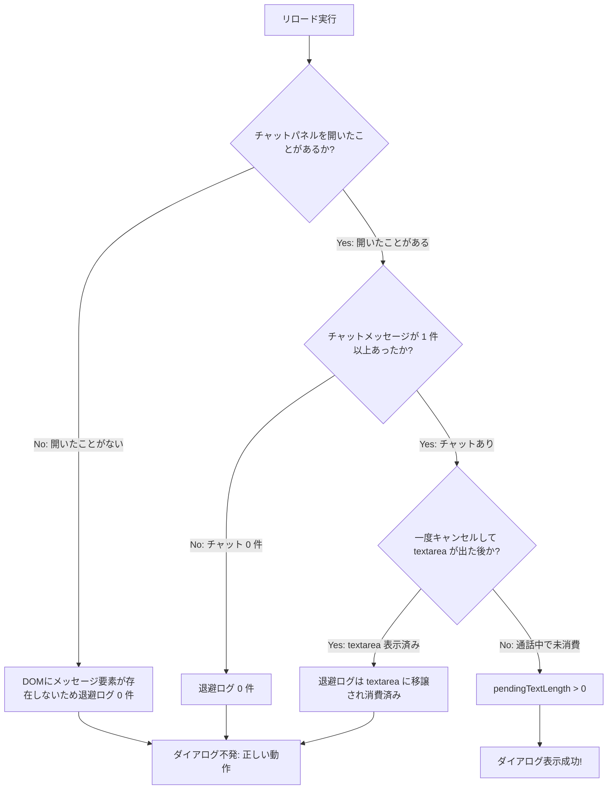

# 実機ログに基づく `beforeunload` ダイアログ不発原因の分析と仕様整理

**文書ステータス:** 調査・分析計画書（確定・承認待ち）  
**対象事象:** リロード時にダイアログが出るケースと出ないケースが存在する原因の解明  
**実機エビデンス:** DevTools Console ログ（`chatTextLength: 0, pendingTextLength: 0, isLiveSaveTarget: false`）  
**準拠方針書:** [`docs/v6/scope_and_edge_case_policy.md`](./scope_and_edge_case_policy.md)

---

## 1. 実機ログから判明した事実 (Evidence Analysis)

ご提示いただいたスクリーンショットのログ：
```text
[GMCTC] beforeunload state {
    wasSaveTarget: true,
    isLiveSaveTarget: false,
    chatTextLength: 0,
    pendingTextLength: 0,       // ← 退避ログが 0 文字（空）
    pendingExitRoomId: 'dxv-urmo-nyo',
    ...
}
```

### 1.1 なぜダイアログが出なかったのか？
`content.js` のダイアログ要求ガード条件：
```javascript
const hasPendingLog = AppState.pendingExitChatLogText !== '';
if (!hasPendingLog || !isCurrentRoom) {
    return; // ← pendingTextLength が 0 のため、ここで要求がスキップされた
}
```
**`pendingTextLength: 0`（退避ログが 0 件）** であったため、設計仕様通り「救出すべきチャットログが存在しない」と判断されてダイアログ要求がスキップされました。

---

## 2. なぜ `pendingTextLength: 0` になっていたのか？（発生条件の切り分け）

Google Meet の DOM 仕様と本拡張機能のライフサイクルから、以下の 4 つのケースが考えられます：



| ケース | 操作・状況 | `pendingTextLength` | ダイアログの期待動作 | 現実の挙動 |
|---|---|:---:|:---:|:---:|
| **ケース 1** | チャットパネルを開いてチャットを受信後、通話中にリロード | **> 0** | **ダイアログ表示** | **表示される** |
| **ケース 2** | チャットパネルを開いたことがない状態でリロード | **0** | **ダイアログ抑止**（DOM上にログなし） | **表示されない**（正常） |
| **ケース 3** | チャットが 0 件（発言なし）の状態でリロード | **0** | **ダイアログ抑止**（保護対象なし） | **表示されない**（正常） |
| **ケース 4** | リロード ➔ キャンセル（textarea 表示後）➔ 再度リロード | **0** | **ダイアログ抑止**（救出完了済み） | **表示されない**（正常） |

---

## 3. 確認・検証のお願い

「出るとき」と「出ないとき」の違いについて、以下の手順でご確認いただけますでしょうか？

1. **ダイアログが確実に出る操作手順**:
   - 会議室に入室後、**チャットパネルを開く**（右下の吹き出しアイコンをクリック）。
   - チャットで何か 1 件以上メッセージを送信・受信して、**チャット画面に文字が表示されている状態**にする。
   - その状態でリロード（Cmd+R）を実行。
   - ➔ **ダイアログが表示されるか**。

2. **ダイアログが出ないときの状況確認**:
   - 先ほど出なかった時は、上記「ケース 2（チャットパネルを開いていなかった）」「ケース 3（チャット 0 件）」「ケース 4（キャンセル後）」のいずれかでしたでしょうか？
