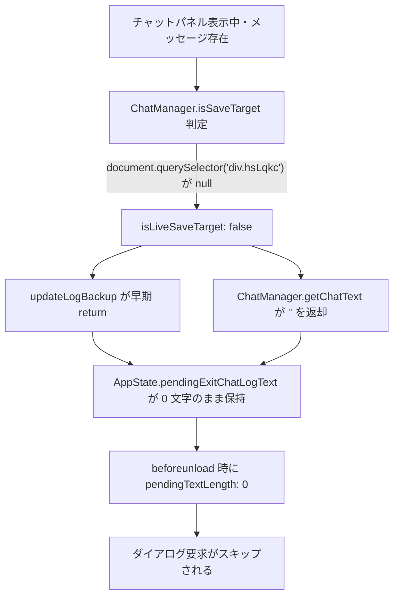

# `isLiveSaveTarget: false` およびログ未退避の根本原因 調査計画書

**文書ステータス:** 調査計画書（確定・承認待ち）  
**対象事象:** チャットパネル表示・メッセージ保持中にもかかわらず `isLiveSaveTarget: false` となりログが退避されない事象  
**実機ログエビデンス:** `isLiveSaveTarget: false, chatTextLength: 0, pendingTextLength: 0`  
**準拠方針書:** [`docs/v6/scope_and_edge_case_policy.md`](./scope_and_edge_case_policy.md)

---

## 1. ログから判明した連鎖的クラッシュ (Root Cause Chain)



### 1.1 なぜログが退避されなかったのか？
1. [`modules/ChatManager.js`](file:///Users/maepon/work/GoogleMeetChatToClipboard/modules/ChatManager.js#L19-L24) の `isSaveTarget()` は `document.querySelector('div.hsLqkc')`（保存されない状態のインジケーター）の存在をチェックします。
2. しかし、実機ログでは **`isLiveSaveTarget: false`** となっていました。
3. そのため：
   - 300ms 毎の `updateLogBackup()` がログ退避を行わない。
   - `getChatText()` も `isSaveTarget` が false のため空文字 `''` を返す。
   - 結果として、通話中ずっと `pendingExitChatLogText` が空のままとなり、ダイアログ要求ガードを通過できなかった。

---

## 2. 調査・切り分け項目 (Investigation Items)

### 項目 1: チャット見出しのコピーボタン表示有無の確認
- チャットパネルを開いた時、見出し（「通話中のメッセージ」等）の横に **丸いコピーアイコンボタン** は表示されていますでしょうか？
  - **表示されていない場合** ➔ `div.hsLqkc` がマッチしておらず、拡張機能自体が「保存対象外ミーティング」として認識できていません。
  - **表示されている場合** ➔ タイミングや別ウィンドウ/iframe の参照問題。

### 項目 2: Meet のインジケーター要素の DOM 確認 (Console 実行)
Meet の Console で以下を実行し、結果をご確認いただけますでしょうか：
```javascript
console.log({
    hsLqkc: document.querySelector('div.hsLqkc'),
    chatHeading: document.querySelector('div[jsname="uPuGNe"] [role="heading"]'),
    chatContainer: document.querySelector('div[jsname="xySENc"][aria-live="polite"]'),
    isSaveTarget: ChatManager.isSaveTarget(document, SELECTORS)
});
```

---

## 3. 解決策の展望
- `div.hsLqkc` のセレクターが現在の Google Meet DOM とズレている場合、最新のインジケーター要素セレクターへ更新することで、正常に保存対象として認識され、ログ退避・コピーボタン表示・離脱確認ダイアログのすべてが連動して解決します。
