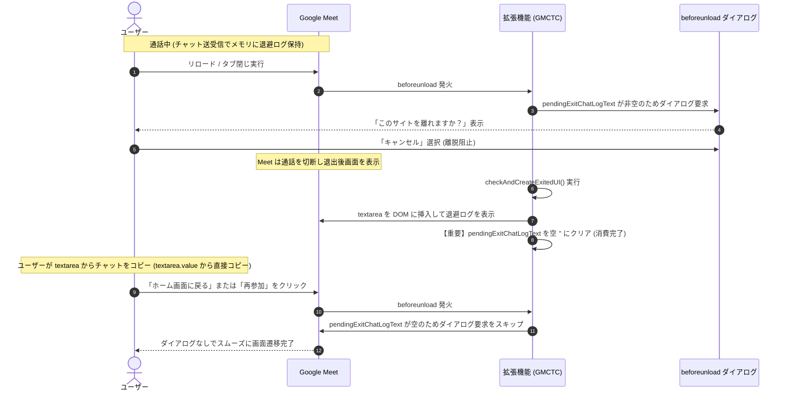

# 退避ログ駆動型 `beforeunload` ダイアログ判定・ライフサイクル再設計 実装計画書（レビュー反映版）

**文書ステータス:** 実装完了・自動テスト完了・実機受入検証待ち  
**対象機能:** メインウィンドウにおける通話中リロード・タブ閉じ時の離脱確認ダイアログ（`beforeunload`）の表示基準見直し、退避ログ（`pendingExitChatLogText`）の消費・クリア制御、および textarea 挿入後のコピー経路独立化（※PinP 側の `beforeunload` は本改修の適用対象外とし、既存の live DOM 判定および回帰なし確認のみを対象とします）  
**準拠方針書:** [`docs/v6/scope_and_edge_case_policy.md`](./scope_and_edge_case_policy.md)  
**関連文書:** [`docs/v6/manual_test_behavior_memos.md`](./manual_test_behavior_memos.md), [`docs/v6/post_exit_beforeunload_suppression_plan.md`](./post_exit_beforeunload_suppression_plan.md)

---

## 1. 背景と課題の整理

### 1.1 現行実装のボトルネック
実機テストにおいて、通話中リロード／タブ閉じ時のダイアログ成功率が約 1/10 に留まっていた原因は以下の構造にありました：

1. **`div.hsLqkc`（保存対象インジケーター）の描画タイミング依存**:
   - Google Meet の仕様上、`div.hsLqkc` およびチャット一覧 DOM は **「右下のチャットサイドパネルを開いている時」にしか DOM に描画されません**。
   - 通常の通話画面（チャットパネルを閉じている状態）でリロードすると、`updateLogBackup()` が `div.hsLqkc` を見つけられず、`wasSaveTarget = false` となりダイアログ要求が 100% スキップされていました。
2. **Meet における離脱キャンセルの前提**:
   - Google Meet では、`beforeunload` ダイアログで「キャンセル」を押してタブの離脱を阻止しても、**Meet 自体の WebRTC 接続は切断され、退出後画面（通話から退出しました）へ移行します**。
   - したがって、このダイアログの唯一の目的は「通話を維持すること」ではなく、**「タブが消えるのを阻止し、同一画面にとどまることで、メモリに退避したチャットログをフォールバック textarea から救出・コピーさせること」** です。

---

## 2. 新設計方針（退避ログの有無を主軸とする）

### 2.1 コアコンセプト
**「救出すべきチャットログがメモリに存在する時だけダイアログを出し、textarea への出力または自動コピーが完了した時点でログを消費（クリア）して、以降の不要なダイアログを一切出さない」**



---

## 3. 前提条件と状態の責務整理

### 3.1 仕様として明記する保護対象の前提
本設計で `beforeunload` の保護対象となるのは、**「対象会議でチャット DOM を参照可能な時点に、非空のチャットログをメモリに退避できていること」** です。

| 状況 | 期待動作 | 理由・背景 |
|---|---|---|
| チャットが 0 件 | **ダイアログを出さない** | 救出すべきデータが存在しないため |
| チャットパネルを一度も開かずログ未退避 | **ダイアログを出さない** | DOM 上にチャットが存在せずメモリに退避できていないため |
| 非空ログを退避済み | **Room 一致時にダイアログを要求** | 未救出のチャットデータが存在するため |
| textarea 表示済み | **ダイアログを出さない** | DOM 上にログが出力・救出済みのため |
| 自動コピー成功済み | **ダイアログを出さない** | クリップボードにログが救出済みのため |
| 別 Room または `/landing` | **旧 Room のログではダイアログを出さない** | stale な旧セッションログによる誤保護を防ぐため |

### 3.2 状態ごとの責務整理
実装および保守時の混同を防ぐため、各状態変数の責務を以下のように明確に分離します。

| 状態変数 | 責務・役割 |
|---|---|
| `wasSaveTarget` | 通話中に対象会議（`div.hsLqkc` 検出）であった実績を保持し、**退出後 UI（textarea）の生成を対象会議だけに限定する**（`beforeunload` の直接判定条件からは除外）。 |
| `pendingExitChatLogText` | **まだ自動コピー・textarea 出力のいずれでも救出されていないメモリ退避ログ**を表す。救出完了（コピー成功または textarea 挿入）時に `''` にクリアされる。 |
| `pendingExitRoomId` | 退避ログの所有 Room ID を表し、SPA 画面遷移後の旧 Room ログ混入を防止する。 |
| `postExitCompleted` | 自動コピー成功またはフォールバック UI 作成済みであり、退出後の追加処理・離脱確認を抑止すべき状態を表す。 |
| `exitedUIInserted` | フォールバック textarea が DOM 上に挿入済みであることを表す。 |

### 3.3 通話中判定（`isInActiveCall`）の位置付けと責務
- 通話中判定（`isInActiveCall = document.querySelector(SELECTORS.exitButton) != null`）は、**「同一 Room への高速再参加時やポーリング遅延により過去の `postExitCompleted` が残存していても、新しい通話セッション（退出ボタンが存在する状態）の保護ダイアログを確実に維持する補助判定（退出後抑止の例外条件）」** として位置付けます。
- 退出後画面判定（`isPostMeetingScreen`）を `!isInActiveCall && (AppState.postExitCompleted || AppState.exitedUIInserted || document.querySelector(SELECTORS.unprocessedRemovedMessage) != null)` とすることで、アクティブな通話中は退出後フラグに惑わされず保護を継続します。
- 一方で、Google Meet 側の DOM 遷移の過程で退出後画面に古い退出ボタンが一時的に残存した場合、短い遷移中間状態で不要なダイアログが出る可能性があるため、この点については **P1 の実機観測項目** として実機手動テスト時に観測・検証します。

### 3.4 PinP 側の `beforeunload` の扱いについて（対象外の明文化）
- 本設計（退避ログ駆動型判定・ライフサイクル再設計）の適用対象は、**メインウィンドウの `beforeunload` のみ**です。
- **PinP ウィンドウ側の `beforeunload` は今回の改修の適用対象外**とします。
- PinP 側は既存の live DOM 判定ロジック（PinP document 上の `ChatManager.isSaveTarget` および `getChatText`）を維持し、PinP 閉鎖時に live DOM にチャットが存在する場合にのみ `e.returnValue` を設定する既存仕様を継続します。
- 検証においては、PinP 内でのコピーボタン・退出ボタンおよび既存機能に回帰がないこと（[`manual_testing_scenario.md`](./manual_testing_scenario.md) シナリオ 3）を確認範囲とします。

---

## 4. 詳細仕様

### 4.1 `beforeunload` ダイアログ要求の判定ルール

以下の **3 条件をすべて満たす場合のみ** `event.preventDefault()` および `event.returnValue = ''` を実行します：

1. **【主条件】退避ログが 1 文字以上存在する**:
   - `AppState.pendingExitChatLogText !== ''`
   - ※チャット 0 件やログ未退避の場合はダイアログをスキップ。
2. **【Room 一致】退避ログの Room ID と現在の URL が一致している**:
   - `getRoomId() !== null && AppState.pendingExitRoomId === getRoomId()`
3. **【退出画面除外】退出後画面（通話終了済み）ではない**:
   - `!isPostMeetingScreen`
   - ここで `isPostMeetingScreen = !isInActiveCall && (AppState.postExitCompleted || AppState.exitedUIInserted || document.querySelector(SELECTORS.unprocessedRemovedMessage) != null)`
   - ※通話中（`isInActiveCall === true`）であれば退出後画面とはみなさず保護を維持。通話終了後（退出ボタン不在）で処理済みフラグや退出要素が存在する場合にのみダイアログを抑止。

### 4.2 退避ログ（`pendingExitChatLogText`）のライフサイクル管理

| タイミング | 処理内容 | 状態変化 |
|---|---|---|
| **通話中（チャット受信・定期バックアップ）** | チャット要素が存在する場合、テキストを抽出して退避 | `pendingExitChatLogText = currentText`<br>`pendingExitRoomId = roomId`<br>`wasSaveTarget = true` |
| **通話中（手動コピーボタン押下）** | クリップボードへコピー実行（新着に備えて退避ログは維持） | `pendingExitChatLogText` は保持 |
| **正常退出（退出ボタン押下で自動コピー成功時）** | クリップボードにコピー完了したため、退避ログを消費 | `pendingExitChatLogText = ''`<br>`postExitCompleted = true` |
| **リロードキャンセル後（textarea 挿入完了時）** | DOM 上の textarea にテキストを出力完了したため、メモリ退避ログを消費 | `pendingExitChatLogText = ''`<br>`exitedUIInserted = true`<br>`postExitCompleted = true` |
| **新規セッション開始時（`/landing` 経由・別 Room 入室時）** | `clearExitPendingState()` により完全クリア | `pendingExitChatLogText = ''`<br>`pendingExitRoomId = null`<br>`postExitCompleted = false` |

### 4.3 textarea 挿入後のコピー経路独立化（必須対応）

`pendingExitChatLogText` が textarea 挿入後に `''` にクリアされるため、退出後 UI のコピーボタンは **textarea 要素自身の `value` をコピー対象として直接取得・利用** します。

- **`UIManager.createExitedUI`**:
  - コピーボタンのクリックイベントリスナーで `saveChatLogCallback(textarea.value)` を呼び出し、textarea の最新テキストを渡す。
- **`ChatManager.saveChatLog(appState, textOverride)`**:
  - 引数 `textOverride` が渡された場合はそれを最優先でコピー対象とし、渡されない場合は `appState.pendingExitChatLogText || appState.tmpChatLogText` からフォールバック取得する。
- **`content.js` の `saveChatLog`**:
  - 引数 `text` を受け取り `ChatManager.saveChatLog(AppState, text)` へ中継する。

これにより、AppState が後続の Room 遷移やクリーンアップでリセットされても、DOM 上の textarea から確実にチャット本文をコピーできます。

---

## 5. コード変更仕様

### 5.1 [`modules/UIManager.js`](file:///Users/maepon/work/GoogleMeetChatToClipboard/modules/UIManager.js) の変更点

```javascript
// 退出後のUI要素を作成
createExitedUI(config, ids, chatLogText, saveChatLogCallback, targetDoc) {
    if (!targetDoc) {
        console.error('createExitedUI: targetDoc is required');
        return null;
    }
    const textarea = targetDoc.createElement('textarea');
    textarea.id = ids.chatLogTextArea;
    textarea.style.width = config.STYLES.TEXTAREA.width;
    textarea.style.height = config.STYLES.TEXTAREA.height;
    textarea.value = chatLogText;
    
    const copyButton = targetDoc.createElement('button');
    copyButton.textContent = chrome.i18n.getMessage('copyButtonText');
    copyButton.type = 'button';
    // 【重要】textarea の value をコールバックに渡す
    copyButton.addEventListener('click', () => {
        if (typeof saveChatLogCallback === 'function') {
            saveChatLogCallback(textarea.value);
        }
    });
    
    const pElement = targetDoc.createElement('p');
    pElement.append(copyButton);
    
    const wrapDiv = targetDoc.createElement('div');
    wrapDiv.append(textarea, pElement);
    
    return wrapDiv;
}
```

### 5.2 [`modules/ChatManager.js`](file:///Users/maepon/work/GoogleMeetChatToClipboard/modules/ChatManager.js) の変更点

```javascript
// 一時保存されたチャットログをクリップボードに保存
saveChatLog(appState, textOverride) {
    // textOverride があれば優先使用、なければ AppState から取得
    const textToSave = textOverride !== undefined ? textOverride : (appState ? (appState.pendingExitChatLogText || appState.tmpChatLogText) : '');
    if (!textToSave) return;

    if (appState) {
        appState.fallbackCopySucceeded = false;
    }

    if (typeof navigator !== 'undefined' && navigator.clipboard && typeof navigator.clipboard.writeText === 'function') {
        try {
            return navigator.clipboard.writeText(textToSave).then(() => {
                if (appState) {
                    appState.fallbackCopySucceeded = true;
                }
            }).catch(err => {
                const errMsg = typeof chrome !== 'undefined' && chrome.i18n ? chrome.i18n.getMessage('clipboardWriteError') : 'Clipboard write error';
                console.error(errMsg, err);
                this._execCommandClipboard(textToSave, appState, false /* isAutoCopy */);
            });
        } catch (syncErr) {
            const errMsg = typeof chrome !== 'undefined' && chrome.i18n ? chrome.i18n.getMessage('clipboardWriteError') : 'Clipboard write error';
            console.error(errMsg, syncErr);
            this._execCommandClipboard(textToSave, appState, false /* isAutoCopy */);
            return Promise.resolve();
        }
    } else {
        this._execCommandClipboard(textToSave, appState, false /* isAutoCopy */);
        return Promise.resolve();
    }
}
```

### 5.3 [`content.js`](file:///Users/maepon/work/GoogleMeetChatToClipboard/content.js) の変更点

```javascript
// 1. saveChatLog の引数中継
function saveChatLog(text) {
    return ChatManager.saveChatLog(AppState, text);
}

// 2. checkAndCreateExitedUI での退避ログ消費（クリア）
function checkAndCreateExitedUI() {
    if (!AppState.wasSaveTarget) {
        return;
    }
    if (AppState.copyInProgress) {
        return;
    }
    const unprocessedElements = document.querySelectorAll(SELECTORS.unprocessedRemovedMessage);
    if (!unprocessedElements || unprocessedElements.length === 0) {
        return;
    }
    // 退出ボタンまたはPinP退出による自動コピーが成功している場合
    if (AppState.autoCopySucceeded) {
        unprocessedElements.forEach(el => {
            el.setAttribute('data-gmctc-processed', 'true');
        });
        AppState.postExitCompleted = true;
        AppState.pendingExitChatLogText = ''; // 【追加】自動コピー成功につきログ消費
        return;
    }
    if (document.querySelector(`#${IDS.chatLogTextArea}`)) {
        return;
    }
    if (!AppState.pendingExitChatLogText) {
        return;
    }

    for (let removeMessageElement of unprocessedElements) {
        if (removeMessageElement.hasAttribute('data-gmctc-processed')) {
            continue;
        }
        const logTextToDisplay = AppState.pendingExitChatLogText;
        const exitedUI = UIManager.createExitedUI(CONFIG, IDS, logTextToDisplay, saveChatLog, document);
        if (exitedUI) {
            removeMessageElement.after(exitedUI);
            removeMessageElement.setAttribute('data-gmctc-processed', 'true');
            AppState.exitedUIInserted = true;
            AppState.postExitCompleted = true;
            AppState.pendingExitChatLogText = ''; // 【重要】textarea への出力完了によりメモリログをクリア
            break;
        }
    }
}

// 3. beforeunload リスナーの整理
window.addEventListener('beforeunload', (event) => {
    checkRoomChangeAndReset();
    updateLogBackup(document);

    const activeRoomId = getRoomId();
    // 同一 Room の場合のみ live DOM から最新テキストを補完
    if (activeRoomId != null && (AppState.pendingExitRoomId == null || AppState.pendingExitRoomId === activeRoomId)) {
        const currentChatText = ChatManager.getChatText(AppState, SELECTORS, document);
        if (currentChatText !== '') {
            AppState.tmpChatLogText = currentChatText;
            AppState.pendingExitChatLogText = currentChatText;
            AppState.pendingExitRoomId = activeRoomId;
        }
    }

    const hasPendingLog = AppState.pendingExitChatLogText !== '';
    const isCurrentRoom = AppState.pendingExitRoomId != null &&
        activeRoomId != null &&
        AppState.pendingExitRoomId === activeRoomId;

    // 通話中判定（退出ボタンが存在する間はアクティブな通話中）
    const isInActiveCall = document.querySelector(SELECTORS.exitButton) != null;

    // 退出後画面（通話終了後）の判定
    const isPostMeetingScreen = !isInActiveCall && (
        AppState.postExitCompleted ||
        AppState.exitedUIInserted ||
        document.querySelector(SELECTORS.unprocessedRemovedMessage) != null
    );

    // 1. 退避ログが存在しない、または Room が不一致の場合はダイアログを出さない
    if (!hasPendingLog || !isCurrentRoom) {
        return;
    }

    // 2. 既に退出後画面（textarea 出力済みまたは自動コピー済み）にいる場合はダイアログを出さない
    if (isPostMeetingScreen) {
        return;
    }

    // 3. 未保存の退避ログが存在する通話中の離脱時のみ確認ダイアログを要求
    event.preventDefault();
    event.returnValue = '';
});
```

---

## 6. テスト計画

### 6.1 自動テスト項目 ([`test/v6_dom_test.js`](file:///Users/maepon/work/GoogleMeetChatToClipboard/test/v6_dom_test.js))

#### P0: 基本保護および除外テスト
1. **基本保護テスト**:
   - `pendingExitChatLogText` が非空かつ同一 Room の場合、`beforeunload` でダイアログ要求（`defaultPrevented === true`）されること。
2. **チャット 0 件除外テスト**:
   - `pendingExitChatLogText === ''` の場合、`beforeunload` でダイアログ要求されないこと（`defaultPrevented === false`）。
3. **Room 不一致除外テスト**:
   - `pendingExitRoomId !== getRoomId()` の場合、`beforeunload` でダイアログ要求されないこと。

#### P0: textarea 表示後の救出確認テスト
4. **textarea 挿入とログ消費テスト**:
   - `checkAndCreateExitedUI()` 実行後、textarea に退避ログがセットされ、`AppState.pendingExitChatLogText` が `''` にクリアされること。
5. **AppState クリア後の textarea コピーテスト（必須対応）**:
   - textarea 挿入後、`AppState.pendingExitChatLogText = ''` および `AppState.tmpChatLogText = ''` となっても、退出後 UI のコピーボタン押下で textarea の `value` がクリップボードに正常コピーされること。
6. **textarea 表示後の後続遷移抑止テスト**:
   - textarea 出力後（キャンセル復帰後）に再度 `beforeunload` が発火した際、ダイアログが抑止されること。

#### P0: 自動コピー成功後の遷移抑止テスト
7. **自動コピー成功後のログ消費テスト**:
   - 自動コピー成功後、`AppState.pendingExitChatLogText` が `''` にクリアされ、textarea は挿入されないこと。
8. **正常退出後の後続遷移抑止テスト**:
   - 正常退出後、ホーム画面への遷移（`/landing`）や再参加時に `beforeunload` ダイアログが抑止されること。

#### P0: セッションリセットテスト
9. **同一 Room 再参加テスト**:
   - `/landing` 経由で再参加した際、新規セッションでチャットを受信して `pendingExitChatLogText` が設定されるまでダイアログが出ず、受信後は確実にダイアログが出ること。

#### P1: 観測項目（実機手動テスト）
10. **遷移中間状態の不要ダイアログ観測**:
    - 退出処理の中間状態（退出ボタン押下から DOM 反映までの微小時間）で追加離脱操作が行われた場合に不要ダイアログが発生するかを実機で観測し、再現時のみ追加対応を検討する。

---

## 7. 完了条件

1. textarea 表示後のコピーボタンが AppState のクリア後も textarea の本文をコピーできること
2. textarea 表示後のホーム・再参加で `beforeunload` が抑止されること
3. 自動コピー成功後のホーム・再参加で `beforeunload` が抑止されること
4. 自動テスト（`npm test`）が全件 PASS すること
