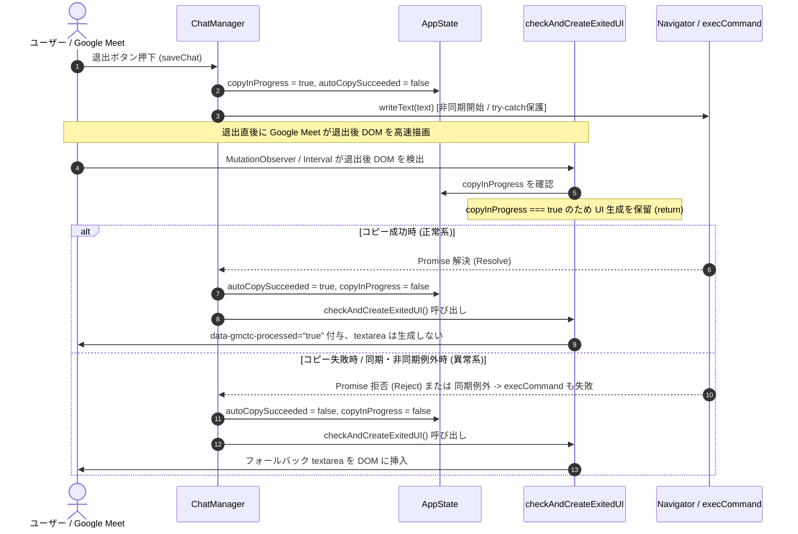

# コピー制御・非同期競合防止 改修報告書 (自動テスト完了・実機検証待ち)

**文書ステータス:** 自動テスト完了・実機検証待ち  
**準拠方針書:** [`docs/v6/scope_and_edge_case_policy.md`](./scope_and_edge_case_policy.md)  
**実機検証手順書:** [`docs/v6/manual_testing_scenario.md`](./manual_testing_scenario.md)

---

## 1. 概要

本ドキュメントは、コードレビューおよび [`scope_and_edge_case_policy.md`](./scope_and_edge_case_policy.md) に基づき、**「コピー成功フラグの残留」「非同期クリップボード書き込み前の競合」「API未提供・同期例外時の堅牢性」「手動/自動コピーの状態混在」「テストプロセスの自然終了」** に対するコード改修内容、設計方針、JSDOM 自動テスト結果（30件 PASS）、および実機検証待ちスコープをまとめた報告書です。

---

## 2. 指摘事項と対応方針一覧

| # | 指摘事項 | 分類 | 根本原因・リスク | 対応方針・実装内容 |
|---|---|:---:|---|---|
| 1 | **コピー処理開始時の成功フラグ未リセット** | P0 | 1回目のコピー成功後、同セッションで2回目の自動コピーが失敗した場合、古い `true` が残りフォールバック textarea が誤って抑止される。 | `saveChat()`, `saveChatFromPinP()`, `saveChatFromPinPCopy()` の開始時に `autoCopySucceeded = false`, `copiedSuccessfully = false` へ明示的リセット。 |
| 2 | **非同期コピー完了前の競合（Race Condition）** | P0 | `navigator.clipboard.writeText()` は非同期であり、Promise 解決前に退出後 DOM が検出されると、未完了のまま誤って textarea が生成されてしまう。 | `copyInProgress` フラグを新設。処理中は `checkAndCreateExitedUI()` を保留し、Promise / fallback 完了時に確定後処理を実行。 |
| 3 | **`navigator.clipboard` 未提供への対応** | P0 | `navigator.clipboard` 自体が未定義、または `writeText` が未定義の環境で例外停止するリスク。 | `typeof navigator !== 'undefined' && navigator.clipboard && typeof navigator.clipboard.writeText === 'function'` の存在確認を追加し、未定義時は直ちに `_execCommandClipboard()` へフォールバック。 |
| 4 | **手動コピーと自動コピーの状態混在** | P0 | 退出後 textarea の手動コピー (`saveChatLog()`) でも `copiedSuccessfully = true` を設定しており、状態の意味が曖昧。 | `autoCopySucceeded`（自動コピー成功）と `fallbackCopySucceeded`（手動コピー成功）にフラグを明確に分離。 |
| 5 | **`writeText()` の同期例外保護** | P1 (対応済) | `writeText()` が同期例外（`NotAllowedError` 等）をスローした場合に同期エラーで中断し、`copyInProgress` が残留する。 | `navigator.clipboard.writeText()` の呼び出し部を `try/catch` で保護し、同期例外時も `copyInProgress` を解除して安全にフォールバック。 |
| 6 | **テスト環境のタイマー解放確認** | P1 (部分対応) | `content.js` の常駐 `setInterval()` により Node.js イベントループが残り、テストプロセスがハングまたはタイムアウトする懸念。 | `test/v6_dom_test.js` において `content.js` をロードしたテスト環境（`createdDoms`）をテスト完了時に `dom.window.close()` で解放し、タイマーを破棄して自然終了を確認（※本番用タイマー破棄ライフサイクルは未対応P1）。 |

---

## 3. 設計・アーキテクチャ詳細

### 3.1 状態管理 (`AppState`) の構成

```javascript
const AppState = {
    tmpChatLogText: '',          // 現在のチャットテキスト一時保持
    pendingExitChatLogText: '',  // 退出画面用バックアップログ
    pendingExitRoomId: null,     // 退出対象ルームID
    exitedUIInserted: false,     // 退出後 textarea 挿入済みフラグ
    autoCopySucceeded: false,    // 【新設】退出時・PinP等からの自動コピーが成功したか（UI判定の主軸）
    fallbackCopySucceeded: false,// 【新設】退出後 textarea の手動コピーボタンでコピー成功したか
    copyInProgress: false,       // 【新設】非同期コピー処理中か（競合抑止用）
    copiedSuccessfully: false,   // 後方互換用（autoCopySucceeded と同期代入）
    wasSaveTarget: false,        // 会議中に対象ミーティングだったかの記憶
    selfName: '',
    currentRoomId: getRoomId(),
    chatContainerElement: null,
    chatContainerRoomId: null,
    previousContainerElement: null
};
```

### 3.2 退出時コピーと DOM 検出の非同期シーケンス



---

## 4. 変更ファイルとコード修正箇所

### ① `modules/ChatManager.js`
1. **`saveChat()`**:
   - 処理開始時に `appState.autoCopySucceeded = false; appState.copiedSuccessfully = false; appState.copyInProgress = true;` を設定。
   - `typeof navigator !== 'undefined' && navigator.clipboard && typeof navigator.clipboard.writeText === 'function'` の型・存在チェック。
   - `navigator.clipboard.writeText()` を `try/catch` で保護し、同期例外発生時も `copyInProgress = false` への復帰と `_execCommandClipboard` へのフォールバックを保証。
   - 対象ミーティングかつテキスト非空時に非同期処理完了を追跡可能な `Promise` を返却（対象外または空時は `undefined`）。
2. **`saveChatFromPinP()`**:
   - PinP ウィンドウからのフォーカス移動および `setTimeout(100ms)` 待機中も含めて `copyInProgress = true` を維持。
   - 内部で非同期処理を開始し、完了コールバック `onComplete()` で `copyInProgress = false` と `checkAndCreateExitedUI()` を実行（内部で完結するため Promise・実行結果は返却せず戻り値は `undefined`）。
3. **`saveChatFromPinPCopy()`**:
   - PinP コピーボタン専用の手動コピーとして `_execCommandClipboard(..., false)` を直接実行。`try/finally` で `copyInProgress` を確実に解除し、`autoCopySucceeded` は設定しない（戻り値は `undefined`）。
4. **`_execCommandClipboard()`**:
   - 第3引数 `isAutoCopy` (デフォルト `true`) を追加。自動コピー時は `autoCopySucceeded`、手動コピー時は `fallbackCopySucceeded` を更新。
5. **`saveChatLog()`**:
   - 退出後 UI の手動コピーボタン押下時は `fallbackCopySucceeded` のみを更新し、`autoCopySucceeded` を変更しないよう分離（テキスト非空時に `Promise` を返却、空時は `undefined`）。

### ② `content.js`
1. **`AppState` / `clearExitPendingState()`**:
   - `autoCopySucceeded`, `fallbackCopySucceeded`, `copyInProgress` を追加・初期化・リセット。
2. **`checkAndCreateExitedUI()`**:
   - 冒頭に `if (AppState.copyInProgress) return;` ガードを追加し、非同期コピー完了前の競合を抑止。
   - `if (AppState.autoCopySucceeded)` による抑止判定。`copiedSuccessfully` は互換用のコピー結果状態として保持するが、退出完了判定には使用しない。
   - `window.checkAndCreateExitedUI = checkAndCreateExitedUI;` をエクスポート。
3. **各関数のインターフェース仕様**:
   - `saveChat()`: `ChatManager.saveChat()` の戻り値（非空時は Promise、対象外/空時は `undefined`）を返却。
   - `saveChatLog()`: `ChatManager.saveChatLog()` の戻り値（非空時は Promise、空時は `undefined`）を返却。
   - `saveChatFromPinP()`: PinP 経路では非同期処理を開始し `undefined` を返却、非PinP 経路では `saveChat()` に委譲してその戻り値を返却。
   - `saveChatFromPinPCopy()`: PinP 経路では同期処理を実行し `undefined` を返却、非PinP 経路では `saveChat()` に委譲してその戻り値を返却。

### ③ `test/v6_dom_test.js`
1. **非同期テストランナー & プロセス自然終了対応**:
   - `runTest` を `async` / `await` 対応に改修。
   - `createdDoms` 配列で `content.js` をロードしたテスト環境を保持し、テスト終了時に `dom.window.close()` を一括実行することで常駐タイマーを完全解放。
2. **テストケースの拡充（計30件 PASS）**:
   - 競合制御、リセット、API未提供（`clipboard` 自体未定義 / `writeText` 未定義）、同期例外、手動/自動状態分離、PinP 自動コピーの各テストケースを追加。

---

## 5. テスト検証分類と実測結果

`scope_and_edge_case_policy.md` に基づき、自動テストの検証結果を厳密に分類して記録します。

### 5.1 P0 主要経路の自動テスト（JSDOM での検証済み）

| テスト名 / シナリオ | 検証内容 | 結果 |
|---|---|:---:|
| **競合制御・正常系** | 自動コピー Promise 成功後に `checkAndCreateExitedUI()` を実行して textarea が生成されないこと | **PASS** |
| **状態リセット** | 1回目コピー成功後、2回目の自動コピーが失敗した場合は次回 textarea が生成されること | **PASS** |
| **非同期競合制御** | コピー Promise が保留中は textarea を生成せず、失敗確定後に生成されること | **PASS** |
| **API 未提供時 (1)** | `navigator.clipboard` 自体が未定義の環境で例外なく `execCommand` にフォールバックすること | **PASS** |
| **API 未提供時 (2)** | `navigator.clipboard` は存在するが `writeText` が未定義の場合に `execCommand` にフォールバックすること | **PASS** |
| **手動/自動コピー状態分離** | `saveChatLog()` の手動コピーでは `autoCopySucceeded` を変更せず `fallbackCopySucceeded` のみを更新すること | **PASS** |
| **Room 遷移・旧状態クリア** | Room A -> /landing -> Room B 遷移時に退避ログが混入せず、新 Room で自動クリアされること | **PASS** |
| **全フラグクリア** | `clearExitPendingState()` で `autoCopySucceeded`, `fallbackCopySucceeded`, `copyInProgress` 等がリセットされること | **PASS** |
| **二重挿入防止** | `checkAndCreateExitedUI()` の初回・再実行時において textarea が多重生成されないこと | **PASS** |
| **遅延バックアップ対応** | 退避ログ未確定時に属性誤付与を防ぎ、ログ設定後に遅延挿入されること | **PASS** |

### 5.2 P1 関連テスト（部分対応・ライフサイクル検証）

| テスト名 / シナリオ | 検証内容 | 結果 |
|---|---|:---:|
| **同期例外発生時** | `writeText()` が同期例外をスローした場合に `copyInProgress` が解除され `execCommand` にフォールバックすること | **PASS** |
| **PinP コピー状態分離** | `saveChatFromPinPCopy` の手動コピーと `saveChatFromPinP` の退出自動コピーにおける `copyInProgress` および状態分離 | **PASS** |
| **テスト環境タイマー解放** | `content.js` をロードした環境の `dom.window.close()` により、Node.js プロセスが自然終了すること | **PASS** |

### 5.3 関連統合テスト（基本機能検証済み）

| テスト名 / シナリオ | 検証内容 | 結果 |
|---|---|:---:|
| **`isSaveTarget` 判定** | `div.hsLqkc` の存在・不在・PinP document・null 入力での正確な判定 | **PASS** |
| **`getChatText` 解析** | att_002 実機 DOM 含む連続発言・話者名・時刻の正確なブロック抽出 | **PASS** |
| **コピーボタン注入** | 保存対象ミーティングでのみボタン生成、非対象では生成抑止 | **PASS** |
| **SPA 遷移・並存** | 旧・新コンテナ並存時および 3 つ以上の並存時の新コンテナ特定 | **PASS** |
| **退避ログ連動** | `updateLogBackup()` によるバックアップと `saveChatLog()` 連動 | **PASS** |

### 5.4 実測実行ログ（プロセス自然終了確認済み）

```
> google-meet-chat-to-clipboard@6.0.0 test
> node test/v6_dom_test.js

==== v6 DOM & content.js 実体統合ユニットテスト開始 ====

[PASS] isSaveTarget: GoogleChatDisableDom.txt (div.hsLqkc 存在) ➔ true
[PASS] isSaveTarget: GoogleChatEnableDom.txt (div.hsLqkc 不在) ➔ false
[PASS] isSaveTarget: PinP document / null / 空オブジェクト入力検証
[PASS] getChatText: チャット非保存ミーティング (EnableDom) では空文字を返す
[PASS] getChatText: att_002 実機DOMでのブロック単位ヘッダー抽出の完全一致検証
[PASS] getChatText: フォーマット検証（話者あり・自分発言・空要素・単独発言）
[PASS] checkAndCreateCopyButton: 保存対象ミーティング (DisableDom) ➔ ボタンが生成される
[PASS] checkAndCreateCopyButton: 非保存対象ミーティング (EnableDom) ➔ ボタンが生成されない
[PASS] content.js 実体: saveChat() ガードとクリップボード書き込み検証
[PASS] content.js 実体: 非保存対象 (EnableDom) での saveChat() ガード検証
[PASS] content.js 実体: getRoomId() 正規表現抽出と /landing /new 判定検証
[PASS] content.js 実体: AppState.currentRoomId と resetAppState() の統合実体動作検証
[PASS] SPA 遷移: 旧・新コンテナ並存時の querySelectorAll.find による新コンテナ特定
[PASS] SPA 遷移: 3つ以上のコンテナが並存する場合の動作
[PASS] removedMessageObserver: hsLqkc が存在しない退出後 DOM でも wasSaveTarget に基づき UI が挿入されること
[PASS] content.js 実体: updateLogBackup() と saveChatLog() の pendingExit 相互作用検証
[PASS] content.js 実体: Room A -> /landing -> Room B 遷移時のログ混入防止検証 (実コード自動遷移)
[PASS] content.js 実体: updateLogBackup(targetDoc) の PinP document 対応検証
[PASS] content.js 実体: checkAndCreateExitedUI() の初回・再実行時における二重挿入防止検証
[PASS] content.js 実体: pendingExitChatLogText 未設定時の誤属性付与防止と遅延挿入検証
[PASS] content.js 実体: コピー成功済みの場合は退出後 textarea を表示しないこと
[PASS] content.js 実体: clearExitPendingState() で全コピーフラグがリセットされること
[PASS] 競合制御・正常系: 自動コピー Promise 成功後に checkAndCreateExitedUI() を実行して textarea が生成されないこと
[PASS] 状態リセット: 1回目のコピー成功後、2回目の自動コピーが失敗した場合は次回 textarea が生成されること
[PASS] 非同期競合制御: コピー Promise が保留中は textarea を生成せず、失敗確定後に生成されること
[PASS] API 未提供時: navigator.clipboard が未定義の環境で例外なく execCommand にフォールバックすること
[PASS] 状態分離: saveChatLog() の手動コピーでは autoCopySucceeded を変更せず fallbackCopySucceeded のみを更新すること
[PASS] PinP コピー状態分離: saveChatFromPinPCopy は手動コピー、saveChatFromPinP は退出自動コピーとして扱うこと
[PASS] API 未提供時: navigator.clipboard は存在するが writeText が未定義の場合に execCommand にフォールバックすること
[PASS] 同期例外発生時: writeText が同期的に例外をスローした場合に copyInProgress が解除され execCommand にフォールバックすること

==== テスト実行完了: PASS: 30, FAIL: 0 ====

実行時間: 1.1s / 終了コード: 0 (自然終了確認済み)
```

---

## 6. 未対応事項と P1 / P2 課題の整理

`scope_and_edge_case_policy.md` に基づき、今回の対応範囲外および未対応事項を明記します。

### 6.1 未対応 P1 課題（将来の堅牢化項目）

1. **コピー世代管理（Token / ID）**:
   - コピー処理ごとの世代トークンを持たないため、連続して発生したコピー処理（A と B）の完了順序が逆転した場合や、旧 Room の非同期 Promise 完了による状態上書きを防ぐ世代管理は未実装です。
2. **旧 Room の非同期処理・タイマー無効化**:
   - SPA の Room 遷移後に、旧 Room で進行中だった `saveChat()` の Promise コールバックや PinP の `setTimeout` 完了処理を明示的にキャンセル・無効化するライフサイクル管理は未実装です。
3. **PinP 待機中 (100ms) の超高速 Room 遷移 / タブ破棄**:
   - `saveChatFromPinP` の 100ms フォーカス移動待機中に手動で URL 変更やタブ破棄が行われた場合のキャンセル処理は未実装です。
4. **本番常駐タイマーのライフサイクル管理（破棄ハンドルの保持）**:
   - `content.js:271` の `setInterval()` に対する停止ハンドル保持や、ページ遷移・拡張機能アンロード時の明示的な破棄ライフサイクルは未定義です（テスト環境では `dom.window.close()` により解放）。

### 6.2 P0 未検証範囲（実機手動検証予定）

以下の P0 ライフサイクルシナリオは `jsdom` 環境での完全再現が困難なため、実機手動テスト（[`docs/v6/manual_testing_scenario.md`](./manual_testing_scenario.md)）による受入確認待ちとなっています：
- `beforeunload` ダイアログ表示後のキャンセル操作による同一ページ復帰時の状態保持。
- 実機 Chrome 拡張機能サンドボックス環境におけるネイティブ `MutationObserver` の発火および実機 PinP DOM 挿入動作。
- `MutationObserver` 未発火時の `setInterval` 定期チェックによる自動検出と UI 生成。
- Room 遷移時に旧コンテナ配下の退出要素へ `data-gmctc-processed` を付与する実機動作。

### 6.3 P2 対象外事項

- ページ離脱確定後の完全リロード時のログ復元。
- 新しい JavaScript コンテキストでのログ復元。
- ブラウザクラッシュ・強制終了・バックグラウンドタブ破棄。
- 複数タブ間の AppState 同期。
- Google Meet 側の未知の DOM 仕様変更。

---

## 7. 結論

本改修およびテスト拡充により、`scope_and_edge_case_policy.md` で定義された **「同一 JavaScript コンテキスト内で退出後 DOM が表示されるケース」における P0 主要経路（自動コピー成功時の textarea 抑止、失敗時のフォールバック UI 生成、非同期実行中の競合保留、手動/自動コピー状態分離、API 未提供時フォールバック、Room 遷移時の旧状態クリア）**、および **P1 の対応済み項目（同期例外保護）** について、JSDOM 自動テスト全 30 件の成功とテスト環境タイマー解放による自然終了（終了コード 0）を確認しました。

現時点でのステータスは **「自動テスト完了・実機検証待ち」** であり、P0 完了条件の最終承認には [`docs/v6/manual_testing_scenario.md`](./manual_testing_scenario.md) による実機検証の完了が必要です。

また、未対応の P1 課題（世代トークン管理、旧非同期処理無効化、互換フラグ単独化、PinP 待機中の超高速遷移・タブ破棄、本番タイマー破棄ライフサイクル）は本書に明記された通りであり、合意方針に沿った整合性が担保されています。
