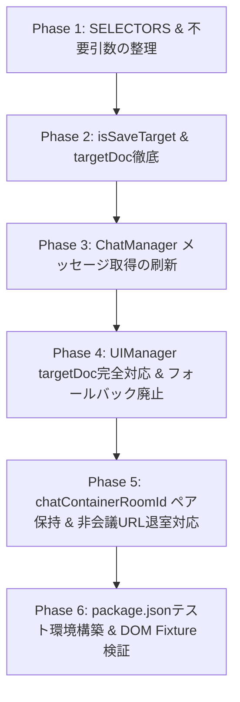

# Google Meet Chat To Clipboard - v6 DOM対応 改変計画書 (Rev 10 修正完了版)

`docs/v6/README.md` および `docs/v6/selector-workspace.md` の方針に基づき、拡張機能を Google Meet の新しい画面構成（v6 DOM）に適合させるための具体的な改変計画です。九次レビューで指摘された非会議 URL (`/landing` 等) への遷移時における状態クリア漏れを補正した修正完了版です。

---

## 1. 改変の目的と背景

1. **新 DOM セレクターの採用**: Google Meet の仕様変更に伴い壊れた Selector を洗い替え、要素の取得粒度を最適化します。
2. **「保存されない状態」のみを対象とする判定ロジック導入**: Google Meet 側で自動保存されないミーティング（`div.hsLqkc` が存在する状態）でのみ拡張機能を有効化し、言語非依存（4言語対応）で判定します。
3. **メッセージ取得ロジックの再構築**: 「全体の要素リスト取得」から「1件のメッセージブロック単位での解析」へ移行し、発信者表示の有無で直感的に自分発言を判定します。
4. **PinP および各コンテキスト間の一貫性・所有権の完全担保**: `targetDoc` の暗黙フォールバックを全廃し、全ての DOM 生成で `targetDoc.createElement()` を強制適用します。
5. **SPA ライフサイクル・ランディング遷移・コンテナ所有権の完全保護**: 非会議 URL (`/landing` 等) への退室時を含めた確実な `resetAppState()` 実行と `activeContainer.contains()` 検証により、状態残留や誤検出を回避します。

---

## 2. セレクター変更一覧

`content.js` の `SELECTORS` 定義を以下のように更新します。

| セレクターキー | 旧定義 | 新定義 (`docs/v6`) | 役割・用途 |
| :--- | :--- | :--- | :--- |
| `exitButton` | `[jsname="CQylAd"]` | `button[jsname="CQylAd"]` | 退出ボタンの検出 |
| `chatContainer` | (未定義) | `div[jsname="xySENc"][aria-live="polite"]` | チャット一覧の親コンテナ |
| `chatMessage` | `[jsname="dTKtvb"] , ...` | `div.Ss4fHf[jsname="Ypafjf"]` | **`chatContainer` 配下で検索** する1件分のメッセージブロック |
| `messageText` | (未定義) | `div[jsname="dTKtvb"]` | メッセージ本文 |
| `messageTime` | (未定義) | `div[jsname="biJjHb"]` | 送信時刻 |
| `messageSender` | (未定義) | `.poVWob` | 発信者表示（非存在時は自分発言） |
| `chatTitle` | `[jsname="uPuGNe"][role="heading"]` | `div[jsname="uPuGNe"] [role="heading"]` | コピーボタン差込用のチャット見出し |
| `nonSaveTargetIndicator`| (未定義) | `div.hsLqkc` | **【新設】** 保存されない状態（対象ミーティング）の判定用 |
| `unprocessedRemovedMessage`| (未定義) | `.lAqQo .roSPhc[jsname="r4nke"]:not([data-gmctc-processed])` | **【新設】** 未処理の退出後メッセージ要素抽出用 |

---

## 3. レビュー指摘に基づく詳細設計・不具合防止仕様 (Rev 10 反映事項)

### ① 非会議 URL (`/landing` 等) 遷移時の確実な状態リセット
会議から `/landing` や `/new` などの非会議 URL へ移動した際（`newRoomId` が `null` になるケース）、`resetAppState()` がスキップされて旧状態（`tmpChatLogText` や `chatOutputFlag`）が残留する課題を補正します。

```javascript
function checkRoomChangeAndReset() {
    const newRoomId = getRoomId();
    if (AppState.currentRoomId !== newRoomId) {
        const previousRoomId = AppState.currentRoomId;
        AppState.currentRoomId = newRoomId;
        if (previousRoomId !== null) {
            resetAppState(previousRoomId);
        }
    }
}
```

### ② コンテナと Room ID のペア保持による無効化
```javascript
function disableOldRemovedMessageElements(previousRoomId) {
    if (
        AppState.chatContainerElement &&
        AppState.chatContainerRoomId === previousRoomId
    ) {
        AppState.chatContainerElement.querySelectorAll(SELECTORS.removedMessage).forEach(el => {
            el.setAttribute('data-gmctc-processed', 'true');
        });
    }
}

function resetAppState(previousRoomId) {
    disableOldRemovedMessageElements(previousRoomId);
    AppState.chatContainerElement = null;
    AppState.chatContainerRoomId = null;
    AppState.tmpChatLogText = '';
    AppState.chatOutputFlag = false;
    AppState.selfName = '';
}
```

### ③ Observer での `activeContainer.contains(removeMessageElement)` 検証
未処理限定セレクター抽出に加え、対象の `removeMessageElement` が **現在アクティブな `chatContainer` の配下ノードであること** を検証します。

```javascript
const removedMessageObserver = ObserverManager.observeForElement(
    SELECTORS.unprocessedRemovedMessage,
    (removeMessageElement) => {
        if (!ChatManager.isSaveTarget(document, SELECTORS)) {
            return;
        }

        const activeContainer = document.querySelector(SELECTORS.chatContainer);
        if (!activeContainer || !activeContainer.contains(removeMessageElement)) {
            return;
        }

        if (AppState.chatOutputFlag === false) {
            const exitedUI = UIManager.createExitedUI(CONFIG, IDS, AppState.tmpChatLogText, saveChatLog, document);
            if (exitedUI) {
                removeMessageElement.after(exitedUI);
                removeMessageElement.setAttribute('data-gmctc-processed', 'true');
                AppState.chatOutputFlag = true;
            }
        }
    },
    false
);
```

---

## 4. 段階的改変ステップ (Execution Steps)



---

## 5. 主要コード実装案 (修正完了版)

### **`content.js`**
```javascript
const SELECTORS = {
    exitButton: 'button[jsname="CQylAd"]',
    chatContainer: 'div[jsname="xySENc"][aria-live="polite"]',
    chatMessage: 'div.Ss4fHf[jsname="Ypafjf"]',
    messageText: 'div[jsname="dTKtvb"]',
    messageTime: 'div[jsname="biJjHb"]',
    messageSender: '.poVWob',
    chatTitle: 'div[jsname="uPuGNe"] [role="heading"]',
    chatMemberName: `.ASy21[title]`,
    nonSaveTargetIndicator: 'div.hsLqkc',
    removedMessage: '.lAqQo .roSPhc[jsname="r4nke"]',
    unprocessedRemovedMessage: '.lAqQo .roSPhc[jsname="r4nke"]:not([data-gmctc-processed])'
};

function getRoomId() {
    const match = location.pathname.match(/^\/([a-z0-9]{3}-[a-z0-9]{4}-[a-z0-9]{3})\/?$/i);
    return match ? match[1] : null;
}

const AppState = {
    tmpChatLogText: '',
    chatOutputFlag: false,
    selfName: '',
    currentRoomId: getRoomId(),
    chatContainerElement: null,
    chatContainerRoomId: null
};

function disableOldRemovedMessageElements(previousRoomId) {
    if (
        AppState.chatContainerElement &&
        AppState.chatContainerRoomId === previousRoomId
    ) {
        AppState.chatContainerElement.querySelectorAll(SELECTORS.removedMessage).forEach(el => {
            el.setAttribute('data-gmctc-processed', 'true');
        });
    }
}

function resetAppState(previousRoomId) {
    disableOldRemovedMessageElements(previousRoomId);
    AppState.chatContainerElement = null;
    AppState.chatContainerRoomId = null;
    AppState.tmpChatLogText = '';
    AppState.chatOutputFlag = false;
    AppState.selfName = '';
}

function checkRoomChangeAndReset() {
    const newRoomId = getRoomId();
    if (AppState.currentRoomId !== newRoomId) {
        const previousRoomId = AppState.currentRoomId;
        AppState.currentRoomId = newRoomId;
        if (previousRoomId !== null) {
            resetAppState(previousRoomId);
        }
    }
}

// 退出済みメッセージ監視 Observer
const removedMessageObserver = ObserverManager.observeForElement(
    SELECTORS.unprocessedRemovedMessage,
    (removeMessageElement) => {
        if (!ChatManager.isSaveTarget(document, SELECTORS)) {
            return;
        }

        const activeContainer = document.querySelector(SELECTORS.chatContainer);
        if (!activeContainer || !activeContainer.contains(removeMessageElement)) {
            return;
        }

        if (AppState.chatOutputFlag === false) {
            const exitedUI = UIManager.createExitedUI(CONFIG, IDS, AppState.tmpChatLogText, saveChatLog, document);
            if (exitedUI) {
                removeMessageElement.after(exitedUI);
                removeMessageElement.setAttribute('data-gmctc-processed', 'true');
                AppState.chatOutputFlag = true;
            }
        }
    },
    false
);

// 統合された定期監視
setInterval(() => {
    checkRoomChangeAndReset();
    getChatMemberName();
    
    const activeRoomId = getRoomId();
    const currentContainer = document.querySelector(SELECTORS.chatContainer);
    if (currentContainer && activeRoomId) {
        AppState.chatContainerElement = currentContainer;
        AppState.chatContainerRoomId = activeRoomId;
    }
}, CONFIG.TIMEOUTS.MEMBER_NAME_CHECK);
```

### **`modules/ChatManager.js`**
```javascript
const ChatManager = {
    isSaveTarget(targetDoc, selectors) {
        if (!targetDoc || !selectors || !selectors.nonSaveTargetIndicator) {
            return false;
        }
        return targetDoc.querySelector(selectors.nonSaveTargetIndicator) !== null;
    },

    getChatText(appState, selectors, targetDoc) {
        if (!targetDoc || !this.isSaveTarget(targetDoc, selectors)) {
            return '';
        }

        const container = targetDoc.querySelector(selectors.chatContainer);
        if (!container) return '';

        const messageBlocks = container.querySelectorAll(selectors.chatMessage);
        const chatMessages = [];

        messageBlocks.forEach(block => {
            const textEl = block.querySelector(selectors.messageText);
            const timeEl = block.querySelector(selectors.messageTime);
            const senderEl = block.querySelector(selectors.messageSender);

            if (!textEl) return;

            const sender = senderEl ? senderEl.innerText.trim() : (appState.selfName || '');
            const time = timeEl ? timeEl.innerText.trim() : '';
            const text = textEl.innerText.trim();

            const lines = [];
            if (sender) lines.push(sender);
            if (time) lines.push(time);
            if (text) lines.push(text);

            if (lines.length > 0) {
                chatMessages.push(lines.join('\n'));
            }
        });

        return chatMessages.length ? chatMessages.join('\n') : '';
    }
};
```

### **`modules/UIManager.js`**
```javascript
const UIManager = {
    checkAndCreateCopyButton(config, selectors, ids, targetDoc) {
        if (!targetDoc || !ChatManager.isSaveTarget(targetDoc, selectors)) {
            return;
        }
        const chatHeadingElement = targetDoc.querySelector(selectors.chatTitle);
        if (chatHeadingElement !== null && targetDoc.querySelector(`#${ids.copyButton}`) === null) {
            const copyButton = this.createCopyButton(config, ids, targetDoc);
            if (copyButton) {
                chatHeadingElement.after(copyButton);
            }
        }
    },

    createCopyButton(config, ids, targetDoc) {
        if (!targetDoc) return null;
        const copyIconSpan = this.createCopyIconSpan(config, targetDoc);
        const copyButton = this.createButtonWithIcon(copyIconSpan, config, ids, targetDoc);
        if (!copyButton) return null;

        copyButton.addEventListener('mouseenter', (e) => this.handleCopyButtonColorChange(e, config.STYLES.COPY_BUTTON_HOVER));
        copyButton.addEventListener('mouseleave', (e) => this.handleCopyButtonColorChange(e, config.STYLES.COPY_BUTTON_NORMAL));
        copyButton.addEventListener('mousedown', (e) => this.handleCopyButtonColorChange(e, config.STYLES.COPY_BUTTON_NORMAL));
        copyButton.addEventListener('mouseup', (e) => this.handleCopyButtonColorChange(e, config.STYLES.COPY_BUTTON_HOVER));
        
        const wrapDiv = targetDoc.createElement('div');
        wrapDiv.append(copyButton);
        return wrapDiv;
    },

    createCopyIconSpan(config, targetDoc) {
        if (!targetDoc) return null;
        const copyIconSpan = targetDoc.createElement('span');
        copyIconSpan.classList.add('google-material-icons');
        copyIconSpan.textContent = 'content_copy';
        copyIconSpan.style.color = config.STYLES.COPY_ICON.color;
        return copyIconSpan;
    },

    createButtonWithIcon(iconElement, config, ids, targetDoc) {
        if (!targetDoc) return null;
        const copyButton = targetDoc.createElement('button');
        copyButton.type = 'button';
        copyButton.style.backgroundColor = config.STYLES.COPY_BUTTON.backgroundColor;
        copyButton.style.border = config.STYLES.COPY_BUTTON.border;
        copyButton.style.padding = config.STYLES.COPY_BUTTON.padding;
        copyButton.style.cursor = config.STYLES.COPY_BUTTON.cursor;
        copyButton.style.borderRadius = config.STYLES.COPY_BUTTON.borderRadius;
        if (iconElement) copyButton.append(iconElement);
        copyButton.id = ids.copyButton;
        return copyButton;
    },

    createExitedUI(config, ids, chatLogText, saveChatLogCallback, targetDoc) {
        if (!targetDoc) {
            console.error('createExitedUI: targetDoc is required');
            return null;
        }
        const textarea = targetDoc.createElement('textarea');
        textarea.id = ids.chatLogTextArea;
        textarea.style.width = config.STYLES.TEXTAREA.width;
        textarea.style.height = config.STYLES.TEXTAREA.height;
        textarea.value = chatLogText;
        
        const copyButton = targetDoc.createElement('button');
        copyButton.textContent = chrome.i18n.getMessage('copyButtonText');
        copyButton.type = 'button';
        copyButton.addEventListener('click', saveChatLogCallback);
        
        const pElement = targetDoc.createElement('p');
        pElement.append(copyButton);
        
        const wrapDiv = targetDoc.createElement('div');
        wrapDiv.append(textarea, pElement);
        return wrapDiv;
    }
};
```

---

## 6. まとめ

九次レビューでご指摘いただいた `/landing` や `/new` などの非会議 URL 遷移時における状態リセット漏れを補正し、`newRoomId` が `null` の場合でも `previousRoomId !== null` であれば `resetAppState()` を確実に実行するロジックを反映しました。

本計画書（Rev 10 修正完了版）をもってすべての設計修正を完了といたします。
